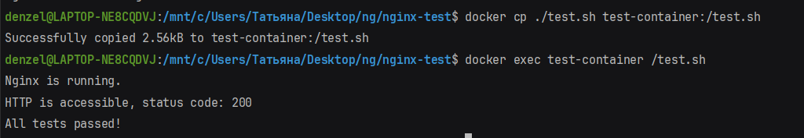
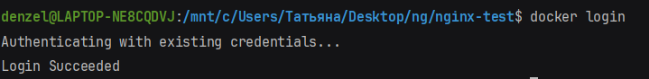
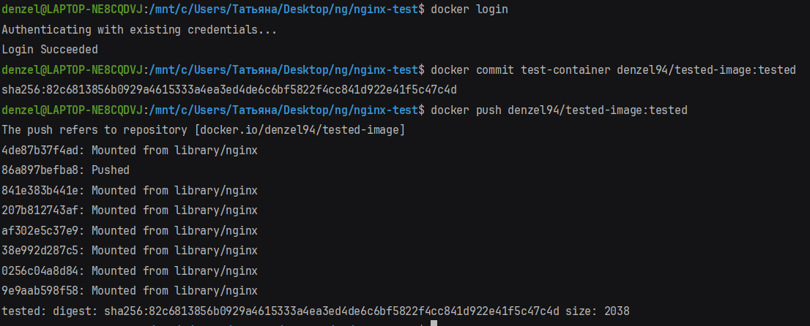
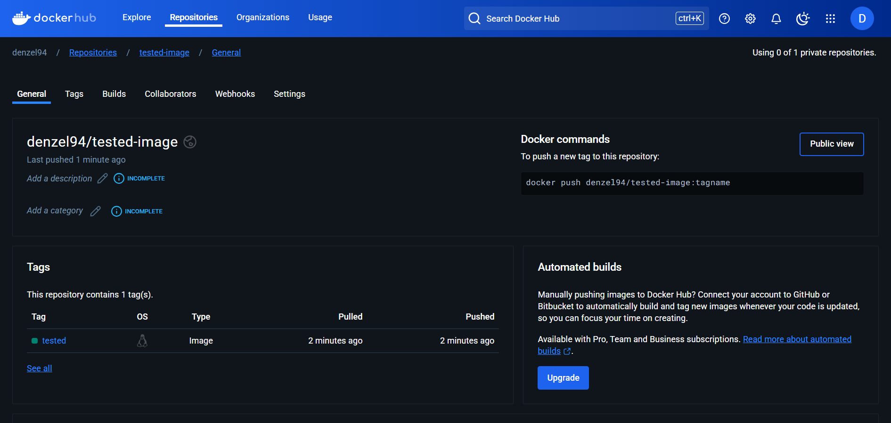

# Задание

Перед развёртыванием публичного контейнера компанией
было принято решение следующую стратегию поведения:
<br/>
Развернуть контейнер с публичным образом, запустить в нём скрипт test.sh, 
добавить протестированный образ в свой аккаунт с тегом tested

---

# Решение

## 1. Развернуть публичный контейнер:

- Пулим публичный образ

```bash
    docker pull nginx
```

- Запускаем контейнер

```bash
    docker run -it --name test-container nginx
```

- Копируем тестовый скрипт в контейнер

```bash
    docker cp test.sh test-container:/test.sh
```

- Запускаем тестовый скрипт в контейнере

```bash
    docker exec test-container /test.sh
```



## 1. Опубликовать протестированный контейнер:

- Авторизуемся  в Docker Hub

```bash
    docker login
```



- Сохраняем протестированный образ

```bash
    docker commit test-container denzel94/tested-image:tested
```

- Загружаем протестированный образ в Docker Hub

```bash
    docker push denzel94/tested-image:tested
```


[Ссылка на протестированный образ в Docker Hub](https://hub.docker.com/repository/docker/denzel94/tested-image/general)


